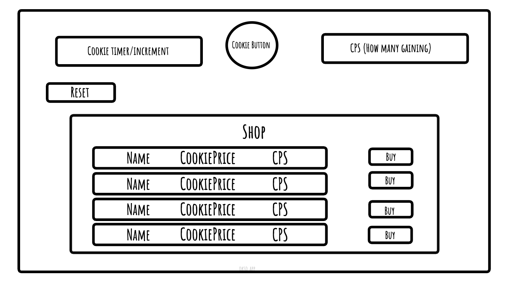

Reflection
Please also provide an assignment reflection in your project README.md file.

Required
🎯 What requirements did you achieve?
- I was able to implement the useState hook and the useEffect hook.
- I included components such as a component for shopItems which will display the upgrades. I had a component for fetching the upgrades from the API, a component for the cookie counter which dealt with increasing the cookies and cps and finally the App component. 
- I used setInterval to execute periodic tasks within the application, and the .map() function to render lists of items in the application dynamically.
- I also used logic to manage the purchase and application of upgrade items within the game

🎯 Were there any requirements or goals that you were unable to achieve?
I think I achieved all the main requriements and did a stretch goal which involved fetching the upgrades from an API. I tried doing it manually first so I created a js file and made an object with all the data which I could import. However I then thought I'd try doing it using an API, as we went through that during class. 

🎯 If so, what was it that you found difficult about these tasks?
I think this was definitely a challenge. I struggled a lot with trying to get the button to increment using the state variables. I made my own one originally which worked, but realised I could use the variables that were given from the walking skeleton, which is where I struggled a bit. It kept saying on the page 'You have NaN cookies' even though the console log showed that I had 100 (I had changed the useState to 100 instead of 0 so I could play around with the numbers). Then with a bit of trial and error I tried changing some of the code in the usEffect function. Originally in the walking skeleton it was `setCookies((currentCookies) => {currentCookies + cps;});` and i changed it to `setCookies((currentCookies) => currentCookies + cps)`. Therefore I removed the {} between currentCookies + cps and it let me increment the amount of cookies. I don't know if that's correct but it worked for me. This issue mainly took the longest time for me but I'm glad it worked out in the end. 

Also I wrote this function to increment the cookie count `function handleClick(){setCookies((currentCookies) => currentCookies + 1)}` which again was sort of done using trial error. I originally wrote `setCookies(cookie + 1)`, why would it have to be `currentCookie + 1` and not `cookie + 1` because I thought it wants to increment from the cookie value which is 0 and why do you have to put currentCookie in brackets? I got a bit confused with that. 

I'm glad I was able to get everything to work in the end. If I had more time I would add media queries and try to save progress using local storage. I'd maybe add more styling as well and try to make more components to make the code cleaner and neater. I did get a bit confused with the components part, as I was trying to see which functions need their own components. Additionally, I maybe try adding ternary operators as I just used a normal if else conditional. Also with the dependendcy array can you explain please why you would put cps inside and not cps and cookies?

What useful external sources helped you complete the assignment (e.g Youtube tutorials)?
I used the demos, react docs
- https://www.youtube.com/watch?v=5llXA0RTYIU&list=PLQg6GaokU5CyvExiaMgXP_BS5WWNBfZJN&index=5&ab_channel=AnthonySistilli
- https://www.youtube.com/watch?v=SbwtUHxRej8&list=PLQg6GaokU5CyvExiaMgXP_BS5WWNBfZJN&index=4&ab_channel=AnthonySistilli
- https://www.youtube.com/watch?v=jeN57Gw98pM&list=PLQg6GaokU5CyvExiaMgXP_BS5WWNBfZJN&index=2&ab_channel=AnthonySistilli
- https://www.youtube.com/watch?v=3Wb9l18KoxI&list=PLQg6GaokU5CyvExiaMgXP_BS5WWNBfZJN&index=9&ab_channel=AnthonySistilli

Please submit your Render deployment URL and your GitHub repository URL.

## Documentation
- Please, add any evidence of your planning stages: wireframes, Trello board, component tree, Lighthouse report, instructions to use your app...

Trello 

Wireframe
